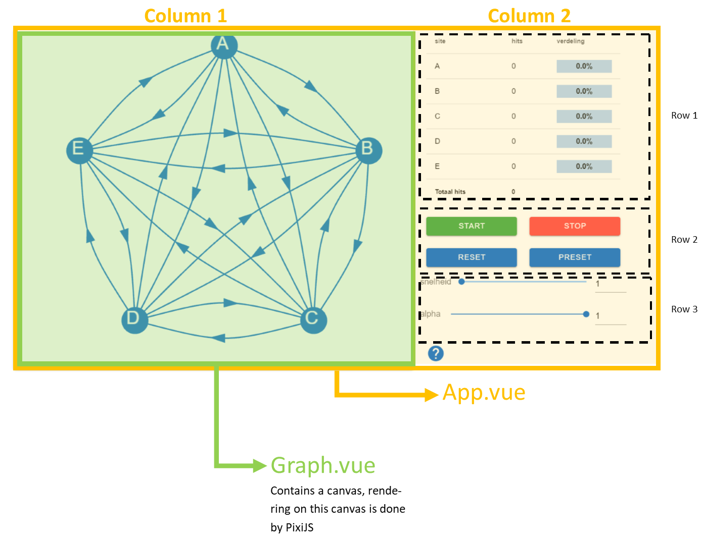

# pageranksimulator
## Overview of the files/pages in src
* __package.json__ used by package manager yarn or npm
* __presets.js__ this file contains the presets that can be loaded using the presets button
* __main.js__ main js file, contains Vue configuration setup
* __App.vue__ is the starting point for the whole app
* __plugins/__ contains plugins used
* __pagerank/__ simple iterative implementation of the pagerank algorithm. All files here contains pure logic and have nothing to do with the visual representation.
  * __/test/__ contains tests for the pagerank algorithm implementation
  * __/Node.js__ node representing a website, used in the algoritm
  * __/PageRankSimulator.js__ the algorithm itself
* __components/__ Contains the components used in the app, this is only visual representation, all logic is in __pagerank/__ folder.
  * __/DrawGraph.js__ Contains the code to draw the graph on an canvas object
  * __/Graph.vue__ Vue component, this component contains a canvas on wich DrawGraph draws
  * __/canvascomponents/__ 
    * __/ConnectorC.js__ A connector component, is visual representation of a connection
    * __/NodeC.js__ A node component, visual representation of a node
    * __/pixi.js__ Used to import only the parts of the PixiJS library needed an thus allowing webpack to lower the size, normally there is no need to edit this.
* __assets/__ images etc.

## Layout overview

# How to run and build the app
## How to generate the files for the webserver
1. [Clone](https://git-scm.com/docs/git-clone) this project
2. install [Yarn](https://yarnpkg.com/) package manager
3. run `yarn install` to install all necessary libraries - this might take several minutes
4. run `yarn build` to build the app - this make take several minutes
5. output files are in the __dist__ folder
## Run locally
__Don't use this in production__
1. [Clone](https://git-scm.com/docs/git-clone) this project
2. install [Yarn](https://yarnpkg.com/) package manager
3. run `yarn install` to install all necessary libraries - this might take several minutes
4. run `yarn serve` to build the app - this make take several minutes
5. now go to the link shown in the console, if you edit a file, the app will automatically be updated

## How to test the app
First follow steps 1-3 from previous paragraph, than use `yarn test`.

